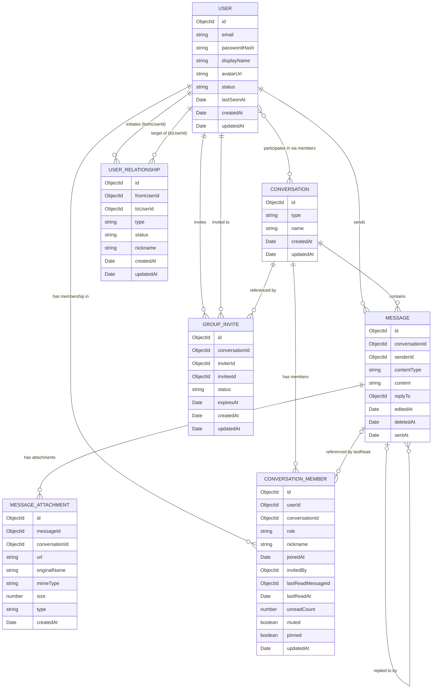

# Chatz — Database Schema Design

> **Version:** 1.3 · **Status:** Production-ready design
> **Stores:** MongoDB 7 (persistent) · Redis 7 (ephemeral)
> **Last updated:** 2026-05-04

---

## 1. MongoDB Entity-Relationship Diagram



---

## 2. Indexing Strategy

### 2.1 Index Definitions

#### `users` collection

| Index Name           | Fields          | Type     | Why                                                                                            |
| -------------------- | --------------- | -------- | ---------------------------------------------------------------------------------------------- |
| `users_email_unique` | `{ email: 1 }`  | Unique   | Login lookup by email. Enforces account uniqueness. Equality-only query.                       |

#### `messages` collection

| Index Name                   | Fields                                                                                                             | Type     | Why                                                                                                                                                                                                         
| ---------------------------- | ------------------------------------------------------------------------------------------------------------------ | -------- | ------------------------------------------------------------------------------------------------------------------------------------------------------------------------------------------------------- 
| `msg_conv_sentAt_id`         | `{ conversationId: 1, sentAt: -1, _id: -1 }`                                                                       | Standard | **Message pagination** — the primary messages read path. Equality on `conversationId` (E), descending sort on `sentAt` then `_id` (S) enables efficient cursor-based backward pagination. The `_id` tiebreaker prevents sort instability when multiple messages share the same sentAt millisecond. Covers the entire scrollback query. |

#### `message_attachments` collection

| Index Name               | Fields                                                 | Type     | Why                                                                                                                             |
| ------------------------ | ------------------------------------------------------ | -------- | ------------------------------------------------------------------------------------------------------------------------------- |
| `att_msgId_1`            | `{ messageId: 1 }`                                     | Standard | Fetch all attachments for a specific message.                                                                                   |
| `att_convId_createdAt`   | `{ conversationId: 1, createdAt: -1 }`                 | Standard | Fetch all attachments in a conversation, sorted by upload time (for "media gallery" feature).                                 |

#### `conversation_members` collection

| Index Name                | Fields                                     | Type     | Why                                                                                                                                                                                                         
| ------------------------- | ------------------------------------------ | -------- | ------------------------------------------------------------------------------------------------------------------------------------------------------------------------------------------------------- 
| `cm_userId_convId_unique` | `{ userId: 1, conversationId: 1 }`         | Unique   | **Upsert membership** — primary key of the relationship. Enforces one document per (user, conversation) pair. Used for both point lookups and updates. E on both fields.                                                                                                                                                                                                         
| `cm_convId_1`             | `{ conversationId: 1 }`                    | Standard | Fetch all member records for a conversation (e.g., to compute total unread, to deliver read receipt events to other participants, or to list members for an admin view).                                                                                                                                                                                                         
| `cm_userId_pinned`        | `{ userId: 1, pinned: -1, updatedAt: -1 }` | Standard | Sidebar with pinned conversations sorted to top, then sorted by recent activity within each pin group. ESR: E on `userId`, S on `pinned` (DESC → pinned=true first) then `updatedAt`. For the full sidebar query, this is step one — conversation-level recency (`conversations.updatedAt`) is resolved in step two by fetching the actual `conversations` documents and sorting those by `updatedAt`. |

#### `group_invites` collection

| Index Name                       | Fields                                                                                          | Type                          | Why                                                                                                                                                                     |
| -------------------------------- | ----------------------------------------------------------------------------------------------- | ----------------------------- | ----------------------------------------------------------------------------------------------------------------------------------------------------------------------- |
| `gi_invitee_status`              | `{ inviteeId: 1, status: 1, , createdAt: -1 }`                                                                   | Standard                      | **Pending invites for a user** — show incoming invitations on login or notification. E on `inviteeId`, E on `status` (values: `"pending"`, `"accepted"`, `"declined"`). |
| `gi_conv_invitee_pending_unique` | `{ conversationId: 1, inviteeId: 1 }` with `{ partialFilterExpression: { status: "pending" } }` | Partial Unique                | **Prevent duplicate pending invites** — one active invite per (conversation, invitee) pair. Partial so accepted/declined invites don't block re-invitation.             |
| `gi_expiresAt_ttl`               | `{ expiresAt: 1 }`                                                                              | TTL (`expireAfterSeconds: 0`) | Automatic purge of expired invites.                                                                                                                                     |

#### `user_relationships` collection

| Index Name            | Fields                                  | Type     | Why                                                                                                                                                                                  |
| --------------------- | --------------------------------------- | -------- | ------------------------------------------------------------------------------------------------------------------------------------------------------------------------------------ |
| `ur_from_to_unique`   | `{ fromUserId: 1, toUserId: 1 }`        | Unique   | **One document per directed pair.** Point lookup for "what is my relationship to user B?" and prevents duplicate relationships. E on both fields.                                    |
| `ur_from_type_status` | `{ fromUserId: 1, type: 1, status: 1 }` | Standard | **Outgoing relationships** — "show my friends" (type="friend", status="accepted"), "show who I blocked" (type="blocked"). ESR: E on `fromUserId`, E on `type`, E on `status`.        |
| `ur_to_type_status`   | `{ toUserId: 1, type: 1, status: 1 }`   | Standard | **Incoming relationships** — "show incoming friend requests" (type="friend", status="pending"), "who blocked me" (type="blocked"). ESR: E on `toUserId`, E on `type`, E on `status`. |

### 2.2 ESR Rule Summary

The **ESR (Equality → Sort → Range)** rule governs compound index field ordering:

1. **Equality** fields first — they reduce the candidate set to the smallest possible subset before any sorting or ranging begins.
2. **Sort** fields second — the index can satisfy `ORDER BY` without a blocking in-memory sort stage (`SORT` in `explain()` output becomes `IXSCAN`).
3. **Range** fields last — range predicates (`$gt`, `$lt`, `$gte`, `$lte`) are placed after sort fields so the sort can still use the index even though the range is open-ended.

**Example** — message pagination: `{ conversationId: 1, sentAt: -1, _id: -1 }`:

- `conversationId: 1` → **Equality**: narrows to one conversation's messages
- `sentAt: -1` → **Sort + Range**: both cursor range (`sentAt < cursor`) and sort direction are satisfied by a single backward b-tree walk
- `_id: -1` → **Sort (tiebreaker)**: prevents sort instability when multiple messages share the same sentAt millisecond; encoded as the second component of the pagination cursor

---

## 3. Design Decisions & Rationale

### 3.1 Read Receipts — Single Source of Truth

**Decision:** Read status is derived entirely from `conversation_members`. There is no `readBy` array on message documents.

**Why:**  
Storing a `readBy` array on every message does not scale for group chats. A group with 100 members would append 100 entries to each message's `readBy` array — unbounded write amplification. Querying "who has read message X" across a conversation of 1,000 messages with 100 members would scan 100,000 array entries.

`conversation_members` solves this by recording only the _furthest read position_ (`lastReadMessageId`, `lastReadAt`) per user per conversation. Read status for any individual message is computed at read time — never stored on the message itself.

**For DMs:** A message is "read" if `message.sentAt <= otherParticipant.lastReadAt`, where `otherParticipant` is found by querying `conversation_members` for the other participant's document. The UI "✓✓ Read at 12:05" is derived from the other user's `lastReadAt`. No per-message query needed — a single member document lookup covers all messages in the conversation.

**For groups:** The unread count badge uses `conversation_members.unreadCount`. The group read receipt UI (if implemented) shows "X of N members have read up to message Y" by querying `conversation_members` for the conversation and comparing `lastReadMessageId` values — a single query returning at most N documents.

**Removed:** The `readBy` concept is fully removed from the message schema. Message read ticks are computed at read time from conversation member state, keeping messages as immutable, append-only facts.

---

### 3.2 Cursor Pagination vs. Skip

**Decision:** Cursor-based pagination using `(sentAt, _id)` as the cursor. No `skip()`.

**Why:**  
`skip(N)` forces MongoDB to scan and discard the first N documents on every page request. For a conversation with 10,000 messages, loading page 200 means scanning 10,000 documents to return 50. Performance degrades linearly with depth.

Cursor pagination uses a stable anchor point:

```javascript
db.messages.find({
  conversationId: conversationId,
  $or: [
    { sentAt: { $lt: cursorSentAt } },
    { sentAt: cursorSentAt, _id: { $lt: cursorId } }
  ]
}).sort({ sentAt: -1, _id: -1 }).limit(50)
```

This is always an index range scan starting from `cursorSentAt`, regardless of how many messages precede it. Performance is O(log n + page_size) at any depth.

`_id` is used as a tiebreaker when `sentAt` values collide (two messages sent in the same millisecond): `{ sentAt: -1, _id: -1 }` as the sort key, with the cursor encoding both values.

**Trade-off:** Cursor pagination does not support random-access page numbers ("jump to page 50"). For a chat application this is not needed — users scroll linearly or jump to a specific message via a search result (which provides an anchor `_id`/`sentAt` directly).

---

### 3.3 Flat Messages Collection vs. Bucket Pattern

**Decision:** Flat collection — one document per message.

**Why:**  
The bucket pattern (grouping N messages per document by time window) optimizes write throughput and reduces document count at the cost of query complexity. For this application's current scale it introduces unnecessary complexity:

- Bucket queries require `$elemMatch` and array projection, making cursor pagination logic significantly harder to implement correctly.
- Partial updates (edit, delete) within a bucket require positional array operators and careful concurrency handling.
- Fetching a single message by `_id` for reply previews requires knowing which bucket it lives in.

The flat collection with a `{ conversationId: 1, sentAt: -1 }` index handles millions of messages efficiently. MongoDB's b-tree range scans are fast; the bottleneck at scale is typically network I/O and application-layer serialization, not MongoDB scan performance on a well-indexed collection.

